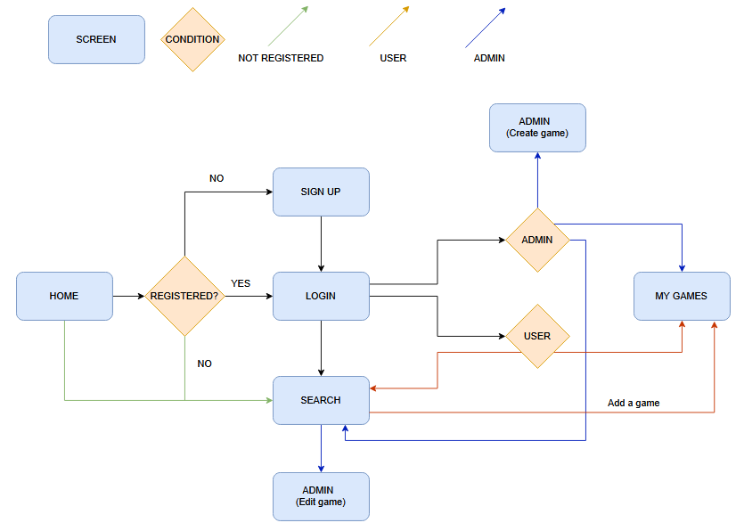
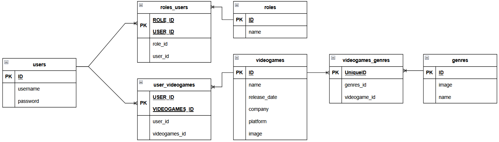

# Wilder-Frontend
Wilder is a website that provides the user with the possibility of storing their favorite games by adding them from a list and the capability to also delete them and filter them by genre.

# Installation
+ Spring initializr
+ Maven project
+ Java 21 language
+ Spring Boot 3.3.4

# Dependencies
+ Spring Boot Dev Tools
+ Spring Web
+ Lombok
+ Spring Boot Security
+ H2 Database 
+ MySQL Driver
+ Spring Data JPA

# Tools
+ Java
+ Spring Boot
+ H2
+ MySQL
+ Docker
+ Postman

# Usage
+ mvn spring-boot:run

# Port 
+ 8080

# Userflow

# ERD

